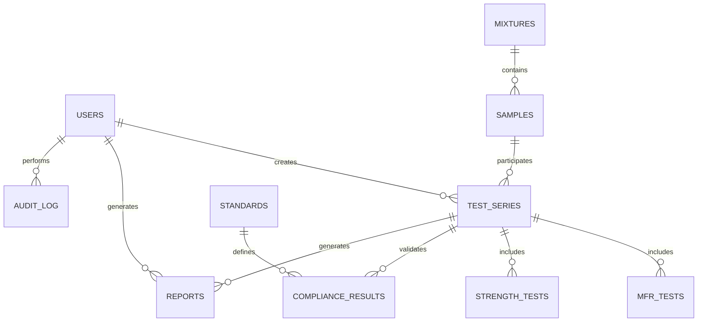

# 04 - Model Danych

# CompLab MFR/T

## Model Danych i Projekt Bazy Danych

**Wersja dokumentu:** 1.0  
**Status:** Ready for Development  
**Powiązanie:** Dokument rozwija model domenowy opisany w `02-Domain-Analysis.md` i stanowi podstawę implementacji warstwy Persistence oraz Infrastructure.

---

# 1. Cel dokumentu

Celem dokumentu jest przedstawienie logicznego i fizycznego modelu danych dla systemu CompLab MFR/T.

Dokument definiuje:

- strukturę bazy danych,
- encje i relacje,
- klucze główne i obce,
- reguły integralności,
- indeksy,
- słowniki systemowe,
- strategię audytu danych,
- diagram ERD.

Model został zaprojektowany dla:

```text
PostgreSQL 16
```

z wykorzystaniem:

```text
Entity Framework Core
Code First
Migracje EF
```

---

# 2. Założenia projektowe

## Założenie 1

Każda próbka należy do jednej mieszaniny.

---

## Założenie 2

Jedna próbka może uczestniczyć w wielu seriach badawczych.

---

## Założenie 3

Jedna seria badawcza może zawierać wiele badań.

---

## Założenie 4

Badanie MFR oraz badanie wytrzymałościowe są przechowywane jako osobne encje.

---

## Założenie 5

Wyniki zatwierdzone nie są usuwane fizycznie.

Stosowany jest mechanizm:

```text
Soft Delete
```

---

## Założenie 6

Każda zmiana danych laboratoryjnych jest rejestrowana w tabeli audytowej.

---

# 3. Konwencje nazewnicze

## Tabele

Liczba mnoga:

```text
Samples
Mixtures
TestSeries
Users
Reports
```

---

## Klucze główne

Format:

```text
<TableName>Id
```

Przykład:

```text
SampleId
```

---

## Klucze obce

Format:

```text
RelatedEntityId
```

Przykład:

```text
MixtureId
```

---

## Daty

Wszystkie daty:

```text
timestamp with time zone
```

UTC.

---

# 4. Główne encje systemu

## Diagram relacji (ERD)



---

# 5. Tabela Users

## Przeznaczenie

Przechowuje użytkowników systemu.

---

## Klucz główny

```text
UserId UUID
```

---

## Pola

```text
UserId
FirstName
LastName
Email
PasswordHash
Role
IsActive
CreatedAt
UpdatedAt
```

---

## Relacje

```text
1 User
N TestSeries

1 User
N Reports

1 User
N AuditLog
```

---

## Indeksy

```sql
Email UNIQUE
```

---

# 6. Tabela Mixtures

## Przeznaczenie

Przechowuje receptury mieszanin polimerowo-kwarcytowych.

---

## Klucz główny

```text
MixtureId UUID
```

---

## Pola

```text
MixtureId
MixtureCode
PolymerPercent
QuartzitePercent
Moisture
Pigment
Description
CreatedAt
CreatedBy
```

---

## Relacje

```text
1 Mixture
N Samples
```

---

## Przykład

```text
MIX-001

Polimer: 25%
Kwarcyt: 75%
Wilgotność: 1.5%
Pigment: Grafit
```

---

# 7. Tabela Samples

## Przeznaczenie

Przechowuje próbki laboratoryjne.

---

## Klucz główny

```text
SampleId UUID
```

---

## Klucz obcy

```text
MixtureId
```

---

## Pola

```text
SampleId
SampleNumber
MixtureId
ProductionDate
Status
Description
CreatedAt
CreatedBy
```

---

## Relacje

```text
N Samples
1 Mixture

1 Sample
N TestSeries
```

---

## Ograniczenia

```text
SampleNumber UNIQUE
```

---

# 8. Tabela TestSeries

## Przeznaczenie

Przechowuje serie badawcze.

---

## Klucz główny

```text
TestSeriesId UUID
```

---

## Klucze obce

```text
SampleId
OperatorId
```

---

## Pola

```text
TestSeriesId
SeriesNumber
SampleId
OperatorId
Status
CreatedAt
ApprovedAt
ApprovedBy
```

---

## Statusy

```text
Draft
InProgress
Completed
Approved
Archived
```

---

## Relacje

```text
1 Sample
N TestSeries

1 User
N TestSeries
```

---

# 9. Tabela MfrTests

## Przeznaczenie

Przechowuje wyniki badań MFR/MFI.

---

## Klucz główny

```text
MfrTestId UUID
```

---

## Klucz obcy

```text
TestSeriesId
```

---

## Pola

```text
MfrTestId
TestSeriesId
Temperature
Load
CuttingTime
ExtrudateMass
MfrValue
Comments
CreatedAt
```

---

## Jednostki

| Parametr | Jednostka |
|-----------|------------|
| Temperature | °C |
| Load | kg |
| CuttingTime | s |
| ExtrudateMass | g |
| MfrValue | g/10 min |

---

## Reguły

```text
Temperature > 0
Load > 0
MfrValue > 0
```

---

# 10. Tabela StrengthTests

## Przeznaczenie

Przechowuje wyniki badań wytrzymałościowych.

---

## Klucz główny

```text
StrengthTestId UUID
```

---

## Klucz obcy

```text
TestSeriesId
```

---

## Pola

```text
StrengthTestId
TestSeriesId
BreakingForceP
StrengthT
Comments
CreatedAt
```

---

## Jednostki

| Parametr | Jednostka |
|-----------|------------|
| BreakingForceP | N |
| StrengthT | MPa |

---

## Reguły

```text
BreakingForceP > 0
StrengthT > 0
```

---

# 11. Tabela Standards

## Przeznaczenie

Repozytorium norm i progów jakościowych.

---

## Klucz główny

```text
StandardId UUID
```

---

## Pola

```text
StandardId
Code
Name
Version
ValidFrom
ValidTo
Description
```

---

## Przykłady

```text
PN-EN 1338
PN-EN 1339
```

---

# 12. Tabela ComplianceResults

## Przeznaczenie

Przechowuje wynik oceny zgodności.

---

## Klucz główny

```text
ComplianceResultId UUID
```

---

## Klucze obce

```text
TestSeriesId
StandardId
```

---

## Pola

```text
ComplianceResultId
TestSeriesId
StandardId
Result
Remarks
CreatedAt
```

---

## Statusy

```text
COMPLIANT
NON_COMPLIANT
WARNING
```

---

# 13. Tabela Reports

## Przeznaczenie

Przechowuje metadane raportów.

---

## Klucz główny

```text
ReportId UUID
```

---

## Klucze obce

```text
TestSeriesId
GeneratedBy
```

---

## Pola

```text
ReportId
TestSeriesId
FileName
FilePath
FileType
GeneratedAt
GeneratedBy
```

---

## Typy raportów

```text
PDF
CSV
XLSX
```

---

# 14. Tabela AuditLog

## Przeznaczenie

Rejestr wszystkich operacji wykonywanych w systemie.

---

## Klucz główny

```text
AuditLogId UUID
```

---

## Klucz obcy

```text
UserId
```

---

## Pola

```text
AuditLogId
UserId
EntityName
EntityId
Action
OldValue
NewValue
IPAddress
CreatedAt
```

---

## Działania

```text
INSERT
UPDATE
DELETE
LOGIN
EXPORT
GENERATE_REPORT
```

---

# 15. Tabela SystemSettings

## Przeznaczenie

Konfiguracja aplikacji.

---

## Klucz główny

```text
SettingId UUID
```

---

## Pola

```text
SettingId
Key
Value
Description
UpdatedAt
```

---

# 16. Słowniki systemowe

## SampleStatusDictionary

Status próbki.

```text
Draft
Testing
Approved
Rejected
Archived
```

---

## UserRoleDictionary

Role użytkowników.

```text
Administrator
LaboratoryManager
Operator
Auditor
```

---

## ReportTypeDictionary

Typ raportu.

```text
PDF
CSV
XLSX
```

---

# 17. Indeksy bazy danych

## Samples

```sql
CREATE UNIQUE INDEX IX_Samples_SampleNumber
ON Samples(SampleNumber);
```

---

## Mixtures

```sql
CREATE UNIQUE INDEX IX_Mixtures_MixtureCode
ON Mixtures(MixtureCode);
```

---

## TestSeries

```sql
CREATE INDEX IX_TestSeries_SampleId
ON TestSeries(SampleId);
```

---

## MfrTests

```sql
CREATE INDEX IX_MfrTests_TestSeriesId
ON MfrTests(TestSeriesId);
```

---

## StrengthTests

```sql
CREATE INDEX IX_StrengthTests_TestSeriesId
ON StrengthTests(TestSeriesId);
```

---

## Reports

```sql
CREATE INDEX IX_Reports_TestSeriesId
ON Reports(TestSeriesId);
```

---

## AuditLog

```sql
CREATE INDEX IX_AuditLog_CreatedAt
ON AuditLog(CreatedAt);
```

---

# 18. Strategia archiwizacji

## Dane aktywne

Zakres:

```text
0 - 5 lat
```

Przechowywane w bazie głównej.

---

## Dane archiwalne

Zakres:

```text
powyżej 5 lat
```

Przenoszone do repozytorium archiwalnego.

---

## Raporty

Przechowywanie:

```text
15 lat
```

---

## Audit Log

Przechowywanie:

```text
10 lat
```

---

# 19. Wymagania integralności danych

## Integralność referencyjna

Wszystkie relacje realizowane przy użyciu:

```text
Foreign Keys
```

---

## Integralność biznesowa

Przykłady:

```text
MFR > 0
```

```text
Strength > 0
```

```text
Moisture od 0 do 100%
```

---

## Integralność audytowa

Każda modyfikacja:

- próbki,
- mieszaniny,
- badania,
- raportu

musi zostać zarejestrowana w AuditLog.

---

# 20. Diagram ERD (wersja docelowa)


---

# Powiązane dokumenty

```text
01-Architecture-Overview.md
02-Domain-Analysis.md
05-API-Design.md
06-Security.md
09-Deployment.md
```

---

# Historia zmian

| Wersja | Data | Opis |
|---------|---------|---------|
| 1.0 | 2026-09-24 | Pierwsza wersja modelu danych |
