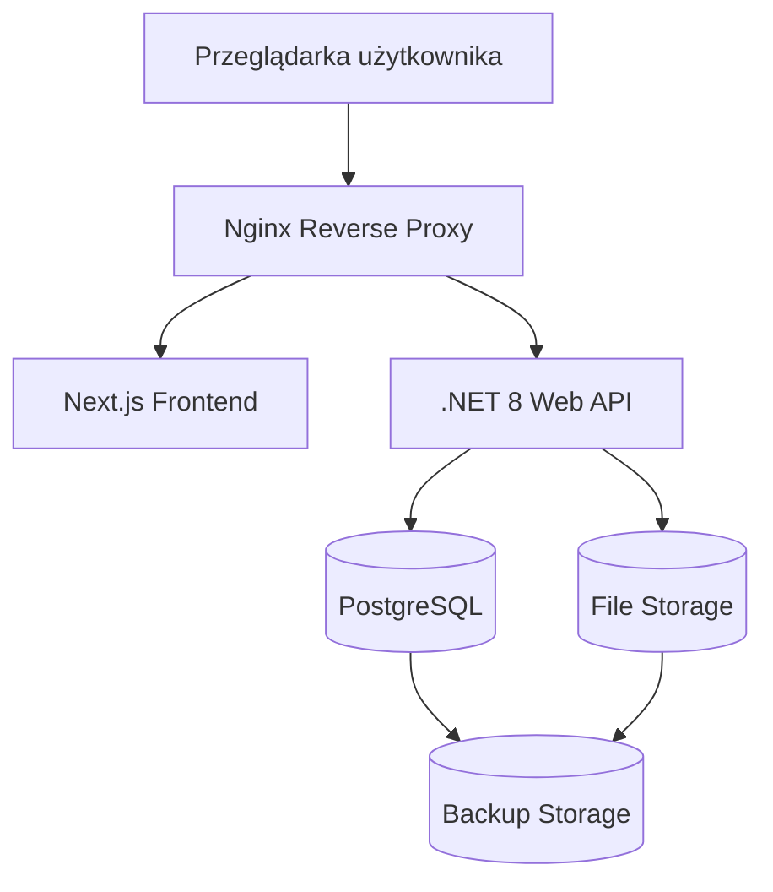

# 09 - Wdrożenie Systemu

# CompLab MFR/T

## Architektura Wdrożeniowa i Utrzymaniowa

**Wersja dokumentu:** 1.0  
**Status:** Ready for Development  
**Powiązanie:** Dokument rozwija założenia przedstawione w:

```text
01-Architecture-Overview.md
03-Technology-Decision.md
06-Security.md
07-DevOps.md
```

---

# 1. Cel dokumentu

Celem dokumentu jest opisanie docelowej architektury wdrożeniowej systemu CompLab MFR/T oraz zasad utrzymania środowiska produkcyjnego.

Dokument określa:

- architekturę fizyczną,
- architekturę wdrożeniową,
- środowiska systemowe,
- wymagania sprzętowe,
- konfigurację Docker,
- strategię publikacji,
- procedury backupu i odtwarzania,
- strategię monitorowania,
- wymagania dla środowiska produkcyjnego.

---

# 2. Założenia wdrożeniowe

System przeznaczony jest do pracy w laboratorium badawczym liczącym:

```text
około 20 użytkowników
```

z możliwością rozwoju do:

```text
50 użytkowników jednoczesnych
```

Aplikacja będzie wdrażana jako rozwiązanie:

```text
On-Premise
```

w sieci wewnętrznej laboratorium.

---

# 3. Architektura fizyczna

## Główne komponenty infrastruktury

```text
Komputery użytkowników
        │
        ▼
Reverse Proxy (Nginx)
        │
        ▼
CompLab API
        │
 ┌──────┴───────────┐
 ▼                  ▼
PostgreSQL      File Storage
        │
        ▼
Backup Storage
```

---

# 4. Komponenty infrastruktury

## Komputery laboratoryjne

Odpowiadają za:

- obsługę aplikacji,
- rejestrację wyników,
- generowanie raportów,
- analizę danych.

---

## Wymagania minimalne

```text
CPU: 2 rdzenie
RAM: 8 GB
Dysk: 256 GB SSD
Przeglądarka: Chrome / Edge
```

---

## Wymagania rekomendowane

```text
CPU: 4 rdzenie
RAM: 16 GB
Dysk: SSD
Rozdzielczość: Full HD
```

---

# 5. Serwer aplikacyjny

## Odpowiedzialność

Hostowanie:

```text
Frontend
Backend API
Raportowanie
```

---

## System operacyjny

Rekomendacja:

```text
Ubuntu Server LTS
```

---

## Wymagania minimalne

```text
CPU: 4 vCPU
RAM: 8 GB
SSD: 100 GB
```

---

## Wymagania rekomendowane

```text
CPU: 8 vCPU
RAM: 16 GB
SSD: 500 GB
```

---

# 6. Serwer bazy danych

## Odpowiedzialność

Przechowywanie:

- użytkowników,
- próbek,
- mieszanin,
- wyników badań,
- raportów,
- audytu.

---

## Silnik bazy

```text
PostgreSQL 16
```

---

## Wymagania minimalne

```text
CPU: 4 vCPU
RAM: 8 GB
SSD: 250 GB
```

---

## Wymagania rekomendowane

```text
CPU: 8 vCPU
RAM: 32 GB
SSD NVMe
```

---

# 7. Magazyn plików

## Przeznaczenie

Przechowywanie:

```text
Raportów PDF
Eksportów CSV
Eksportów XLSX
Załączników
```

---

## Rozwiązania rekomendowane

### MVP

```text
Współdzielony katalog sieciowy
```

---

### Wersja rozwojowa

```text
NAS
```

---

### Wersja enterprise

```text
MinIO
```

---

# 8. Środowiska systemowe

Projekt wykorzystuje cztery środowiska.

---

## DEV

Przeznaczenie:

```text
Prace programistyczne
```

---

## TEST

Przeznaczenie:

```text
Testy integracyjne
Testy QA
```

---

## UAT

Przeznaczenie:

```text
Testy akceptacyjne
```

---

## PROD

Przeznaczenie:

```text
Produkcja
```

---

# 9. Architektura wdrożeniowa

## Diagram wdrożenia



---

# 10. Architektura kontenerowa

System wdrażany jest jako zestaw kontenerów Docker.

---

## Komponenty

### Frontend

```text
complab-web
```

---

### Backend

```text
complab-api
```

---

### PostgreSQL

```text
complab-postgres
```

---

### Reverse Proxy

```text
nginx
```

---

# 11. Docker Compose

Docelowa konfiguracja MVP.

```yaml
services:

  web:
    image: complab-web

  api:
    image: complab-api

  postgres:
    image: postgres:16

  nginx:
    image: nginx:latest
```

---

# 12. Topologia sieci

## Sieć wewnętrzna

```text
192.168.x.x
```

---

## Dostęp użytkowników

Wyłącznie:

```text
HTTPS
```

---

## Dostęp administracyjny

Wyłącznie z:

```text
VPN
Sieć laboratoryjna
```

---

# 13. Konfiguracja Reverse Proxy

## Funkcje

- terminacja TLS,
- routing ruchu,
- limitowanie żądań,
- logowanie dostępu.

---

## Rekomendowane rozwiązanie

```text
Nginx
```

---

# 14. Certyfikaty TLS

## Minimalna wersja

```text
TLS 1.3
```

---

## Algorytmy

```text
RSA 2048+
lub
ECDSA
```

---

## Certyfikaty

### Środowiska nieprodukcyjne

```text
Self-Signed
```

---

### Produkcja

```text
Certyfikat wewnętrzny CA
lub
Certyfikat publiczny
```

---

# 15. Migracje bazy danych

## Technologia

```text
Entity Framework Core
```

---

## Proces

```text
Build
↓
Migration
↓
Review
↓
Deploy
↓
Database Update
```

---

## Komenda

```bash
dotnet ef database update
```

---

# 16. Strategia publikacji

## MVP

Wdrożenie:

```text
Rolling Update
```

---

## Cykl publikacji

```text
DEV
↓
TEST
↓
UAT
↓
PROD
```

---

## Zasady

- wdrożenie tylko po przejściu testów,
- zatwierdzenie przez Product Ownera,
- zatwierdzenie przez Kierownika Laboratorium.

---

# 17. Zarządzanie konfiguracją

## Aplikacja

Konfiguracja środowiskowa:

```text
appsettings.Development.json
appsettings.Test.json
appsettings.Uat.json
appsettings.Production.json
```

---

## Sekrety

Przechowywane poza repozytorium.

---

## Przykłady

```text
Connection Strings
JWT Keys
SMTP Credentials
API Keys
```

---

# 18. Monitoring

## Cele

- monitorowanie dostępności,
- wykrywanie błędów,
- analiza wydajności.

---

## Monitorowane parametry

### System

```text
CPU
RAM
Dysk
Sieć
```

---

### Aplikacja

```text
Liczba żądań
Czas odpowiedzi
Liczba błędów
```

---

### Baza danych

```text
Połączenia
Zapytania
Rozmiar danych
```

---

# 19. Logowanie aplikacyjne

## Mechanizm

```text
Serilog
```

---

## Poziomy logów

```text
Information
Warning
Error
Critical
Audit
```

---

## Lokalizacja

```text
/var/log/complab
```

lub

```text
Docker Volumes
```

---

# 20. Backup

## Baza danych

Backup automatyczny:

```text
Każdego dnia o 01:00
```

---

## Raporty

Backup automatyczny:

```text
Każdego dnia o 02:00
```

---

## Backup pełny

```text
Raz w tygodniu
```

---

## Backup miesięczny

```text
Raz w miesiącu
```

---

# 21. Disaster Recovery

## Cel

Przywrócenie działania systemu po awarii.

---

## RPO

Maksymalna utrata danych:

```text
24 godziny
```

---

## RTO

Maksymalny czas odtworzenia:

```text
4 godziny
```

---

## Kroki odtworzenia

```text
Odtworzenie serwera
↓
Odtworzenie bazy danych
↓
Odtworzenie raportów
↓
Weryfikacja integralności
↓
Uruchomienie aplikacji
```

---

# 22. Retencja danych

## Dane laboratoryjne

```text
15 lat
```

---

## Raporty PDF

```text
15 lat
```

---

## Audit Log

```text
10 lat
```

---

## Logi aplikacyjne

```text
2 lata
```

---

# 23. Wymagania produkcyjne

## Dostępność

Docelowe SLA:

```text
99,5%
```

---

## Wydajność

API:

```text
95% żądań poniżej 500 ms
```

---

## Raport PDF

```text
poniżej 10 sekund
```

---

## Dashboard

```text
poniżej 3 sekund
```

---

# 24. Skalowanie systemu

## MVP

Pojedynczy serwer.

```text
Web
API
Database
File Storage
```

---

## Wersja rozwojowa

Separacja usług:

```text
Frontend
Backend
Database
Storage
```

---

## Wersja Enterprise

Środowisko HA.

```text
Load Balancer
2x API
PostgreSQL Replication
NAS
```

---

# 25. Roadmapa wdrożeniowa

## Wersja MVP

- Docker Compose
- PostgreSQL
- Nginx
- Linux Server
- Backup automatyczny

---

## Wersja V2

- Monitoring infrastruktury
- Dashboard administracyjny
- Centralizacja logów

---

## Wersja V3

- Kubernetes
- High Availability
- Disaster Recovery Site
- Active-Standby

---

# Powiązane diagramy

```text
docs/architecture/diagrams/

architecture.mmd
erd.mmd
process-flow.mmd
```

---

# Powiązane dokumenty

```text
01-Architecture-Overview.md
03-Technology-Decision.md
06-Security.md
07-DevOps.md
08-Testing-Strategy.md
```

---

# Lista kontrolna wdrożenia

## Infrastruktura

- [ ] Serwer Linux przygotowany
- [ ] PostgreSQL skonfigurowany
- [ ] Storage skonfigurowany
- [ ] Backup skonfigurowany

---

## Aplikacja

- [ ] Frontend wdrożony
- [ ] Backend wdrożony
- [ ] Certyfikat TLS aktywny
- [ ] Reverse Proxy skonfigurowany

---

## Bezpieczeństwo

- [ ] HTTPS aktywne
- [ ] JWT skonfigurowane
- [ ] RBAC aktywne
- [ ] Firewall skonfigurowany

---

## Operacje

- [ ] Monitoring aktywny
- [ ] Logowanie aktywne
- [ ] Test Disaster Recovery wykonany
- [ ] Dokumentacja aktualna

---

# Historia zmian

| Wersja | Data | Opis |
|---------|---------|---------|
| 1.0 | 2026-09-24 | Pierwsza wersja dokumentu architektury wdrożeniowej |
