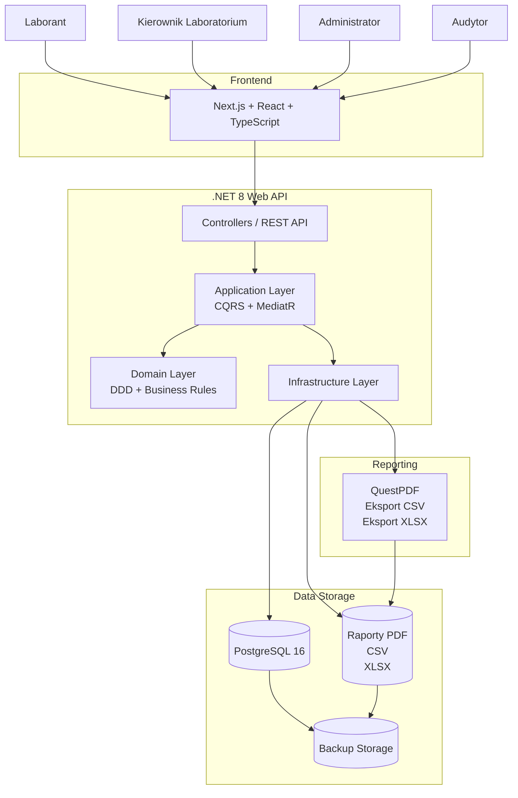
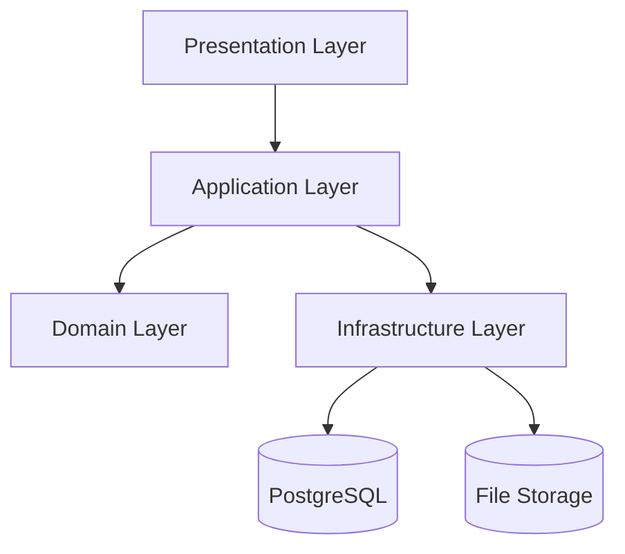
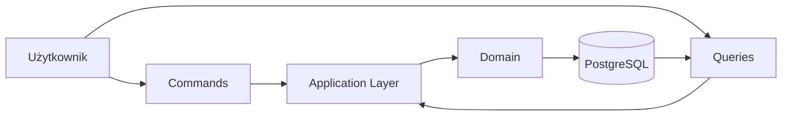
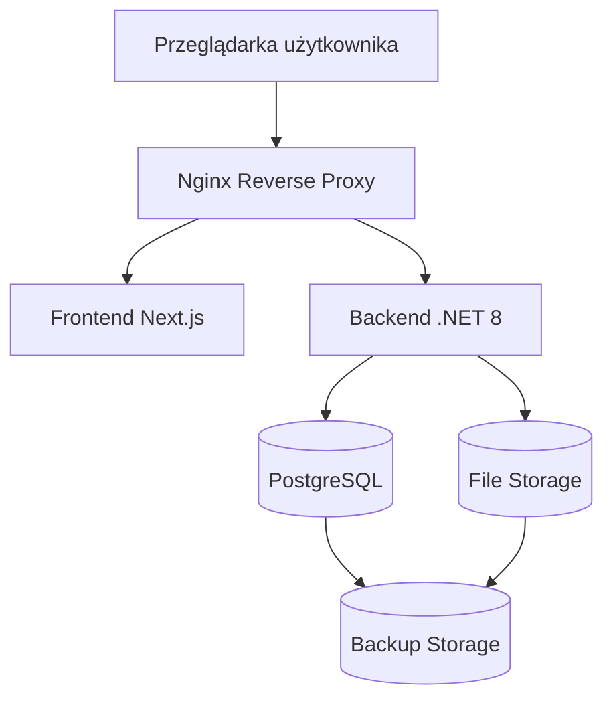
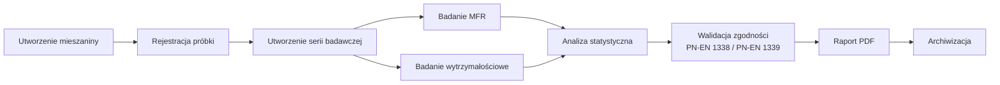
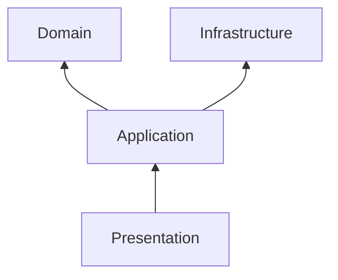

# Diagram Architektury Systemu

# CompLab MFR/T

## Architektura Logiczna i Fizyczna

**Wersja:** 1.0  
**Status:** Ready for Development

---

# Cel diagramu

Diagram przedstawia wysokopoziomową architekturę systemu CompLab MFR/T zgodną z:

- Clean Architecture,
- Domain-Driven Design (DDD),
- CQRS,
- DevSecOps,
- dobrymi praktykami LIMS.

Diagram pokazuje zależności pomiędzy użytkownikami, warstwami aplikacji, infrastrukturą oraz komponentami odpowiedzialnymi za raportowanie i archiwizację danych laboratoryjnych.

---

# Architektura systemu



---

# Architektura Clean Architecture



---

# Architektura CQRS



---

# Architektura wdrożeniowa



---

# Przepływ danych laboratoryjnych



---

# Komponenty systemu

## Frontend

Odpowiedzialność:

- formularze laboratoryjne,
- dashboardy,
- wykresy,
- raporty,
- autoryzacja użytkowników.

Technologie:

```text
Next.js
React
TypeScript
Apache ECharts
```

---

## Warstwa Aplikacyjna

Odpowiedzialność:

- CQRS,
- obsługa przypadków użycia,
- walidacja,
- autoryzacja.

Technologie:

```text
ASP.NET Core
MediatR
FluentValidation
```

---

## Warstwa Domenowa

Odpowiedzialność:

- logika biznesowa,
- agregaty,
- encje,
- reguły zgodności,
- zdarzenia domenowe.

Technologie:

```text
C#
DDD
Clean Architecture
```

---

## Warstwa Infrastruktury

Odpowiedzialność:

- komunikacja z bazą danych,
- generowanie raportów,
- obsługa plików,
- logowanie.

Technologie:

```text
Entity Framework Core
PostgreSQL
QuestPDF
Serilog
```

---

## Magazyn danych

Przechowywane informacje:

- próbki,
- mieszaniny,
- serie badawcze,
- wyniki badań,
- raporty,
- logi audytowe.

Technologia:

```text
PostgreSQL 16
```

---

# Diagram zależności warstw



---

# Wymagania architektoniczne

## MVP

- pojedynczy serwer aplikacyjny,
- PostgreSQL,
- Docker Compose,
- magazyn plików lokalny,
- backup automatyczny.

---

## Wersja V2

- dashboard KPI,
- monitoring infrastruktury,
- centralizacja logów.

---

## Wersja V3

- High Availability,
- Kubernetes,
- replikacja PostgreSQL,
- integracja urządzeń laboratoryjnych.
