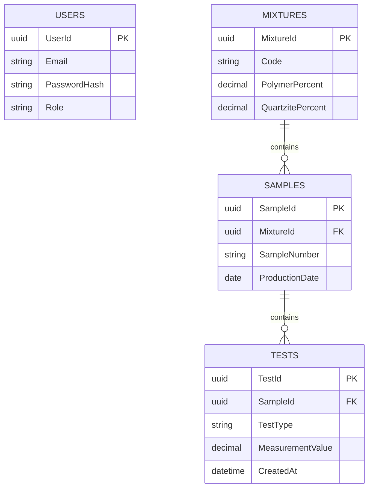

# 04 - Model Danych

# CompLab MFR/T

## Model Danych MVP

**Wersja dokumentu:** 2.0 MVP  
**Status:** MVP Definition

---

# 1. Cel dokumentu

Celem dokumentu jest przedstawienie uproszczonego modelu danych dla wersji MVP systemu CompLab MFR/T.

Model został zaprojektowany dla:

```text
PostgreSQL
```

z wykorzystaniem:

```text
Entity Framework Core
Code First
Migracje EF Core
```

---

# 2. Założenia projektowe

## Założenie 1

Każda próbka należy do jednej mieszaniny.

---

## Założenie 2

Jedna mieszanina może posiadać wiele próbek.

---

## Założenie 3

Jedna próbka może posiadać wiele wyników badań.

---

## Założenie 4

Wszystkie typy badań przechowywane są w jednej tabeli.

---

## Założenie 5

System przechowuje wyłącznie dane niezbędne do realizacji MVP.

---

# 3. Konwencje nazewnicze

## Tabele

```text
Users
Mixtures
Samples
Tests
```

---

## Klucze główne

Format:

```text
<TableName>Id
```

Przykład:

```text
SampleId
```

---

## Klucze obce

Format:

```text
RelatedEntityId
```

Przykład:

```text
MixtureId
```

---

## Daty

Przechowywane w:

```text
UTC
```

---

# 4. Diagram ERD



---

# 5. Tabela Users

## Przeznaczenie

Przechowuje użytkowników systemu.

---

## Klucz główny

```text
UserId UUID
```

---

## Pola

```text
UserId
Email
PasswordHash
Role
```

---

## Role

```text
Administrator

Operator
```

---

## Ograniczenia

```text
Email UNIQUE
```

---

# 6. Tabela Mixtures

## Przeznaczenie

Przechowuje mieszaniny materiałowe.

---

## Klucz główny

```text
MixtureId UUID
```

---

## Pola

```text
MixtureId
Code
PolymerPercent
QuartzitePercent
```

---

## Przykład

```text
MIX-001

Polimer: 25%

Kwarcyt: 75%
```

---

## Ograniczenia

```text
Code UNIQUE
```

---

# 7. Tabela Samples

## Przeznaczenie

Przechowuje próbki laboratoryjne.

---

## Klucz główny

```text
SampleId UUID
```

---

## Klucz obcy

```text
MixtureId
```

---

## Pola

```text
SampleId
MixtureId
SampleNumber
ProductionDate
```

---

## Relacje

```text
N Samples

1 Mixture
```

---

## Ograniczenia

```text
SampleNumber UNIQUE
```

---

# 8. Tabela Tests

## Przeznaczenie

Przechowuje wyniki badań laboratoryjnych.

---

## Klucz główny

```text
TestId UUID
```

---

## Klucz obcy

```text
SampleId
```

---

## Pola

```text
TestId
SampleId
TestType
MeasurementValue
CreatedAt
```

---

## Typy badań

```text
MFR

STRENGTH
```

---

## Przykłady

### Badanie MFR

```text
TestType = MFR

MeasurementValue = 8.9
```

---

### Badanie wytrzymałościowe

```text
TestType = STRENGTH

MeasurementValue = 4.2
```

---

## Reguły

```text
MeasurementValue > 0
```

---

# 9. Relacje

## Mixtures -> Samples

```text
1 : N
```

Jedna mieszanina może posiadać wiele próbek.

---

## Samples -> Tests

```text
1 : N
```

Jedna próbka może posiadać wiele badań.

---

# 10. Indeksy

## Users

```sql
CREATE UNIQUE INDEX IX_Users_Email
ON Users(Email);
```

---

## Mixtures

```sql
CREATE UNIQUE INDEX IX_Mixtures_Code
ON Mixtures(Code);
```

---

## Samples

```sql
CREATE UNIQUE INDEX IX_Samples_SampleNumber
ON Samples(SampleNumber);
```

---

## Tests

```sql
CREATE INDEX IX_Tests_SampleId
ON Tests(SampleId);
```

---

# 11. Integralność danych

## BR-001

Numer próbki musi być unikalny.

---

## BR-002

Próbka musi być przypisana do mieszaniny.

---

## BR-003

Badanie musi być przypisane do próbki.

---

## BR-004

Wartość badania musi być większa od zera.

```text
MeasurementValue > 0
```

---

## BR-005

Kod mieszaniny musi być unikalny.

---

# 12. Przewidywany rozmiar danych

## MVP

Próbki:

```text
do 10 000 rekordów
```

---

Badania:

```text
do 100 000 rekordów
```

---

Mieszaniny:

```text
do 5 000 rekordów
```

---

# 13. Rozszerzenia po MVP

## Wersja 2

Planowane dodanie:

```text
Reports
ComplianceResults
Standards
AuditLog
```

---

## Wersja 3

Planowane dodanie:

```text
TestSeries
Urządzenia laboratoryjne
Automatyczny import danych
```

---

# Powiązane dokumenty

```text
01-Architecture-Overview.md
02-Domain-Analysis.md
05-API-Design.md
09-Deployment.md
```

---

# Historia zmian

| Wersja | Data | Opis |
|---------|---------|---------|
| 1.0 | 2026-09-24 | Model docelowy |
| 2.0 MVP | 2026-09-25 | Uproszczenie modelu danych dla MVP |
